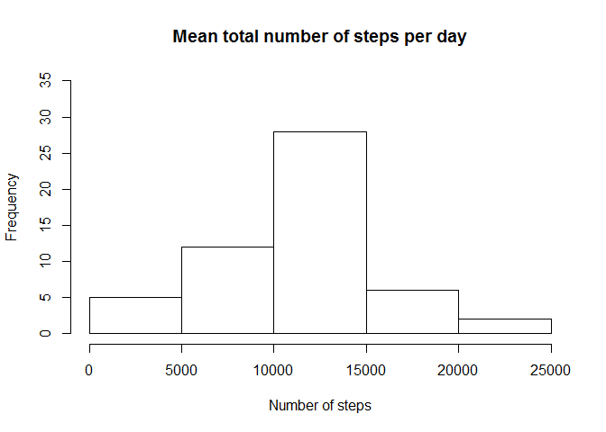
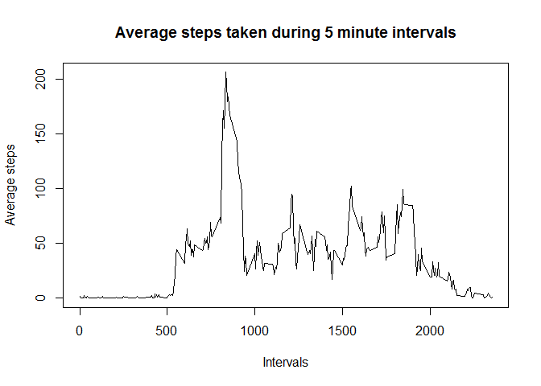
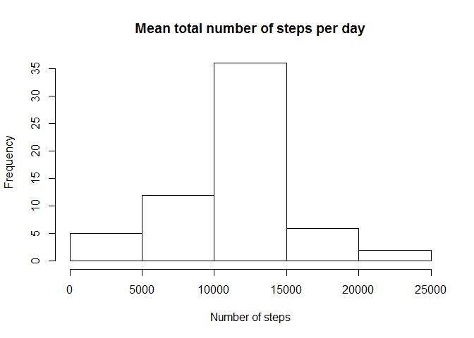
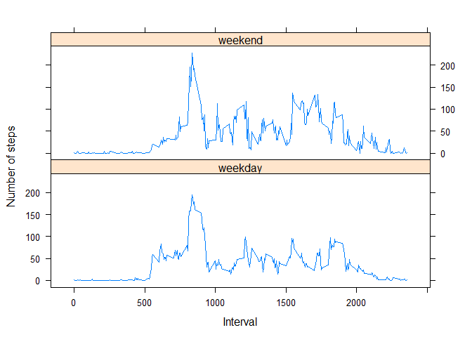

# Reproducible Research - Project-1
Murali Krishna K S S  
27 November 2016  


### Code for reading in the dataset and/or processing the data


```r
df <- read.csv("activity.csv",header = T, stringsAsFactors = F)
df$date <- as.Date(df$date, '%Y-%m-%d')
```

##1. What is mean total number of steps taken per day? 
*For this part of the assignment, you can ignore the missing values in the dataset.Make a histogram of the total number of steps taken each day. Calculate and report the mean and median total number of steps taken per day*

### Histogram of the total number of steps taken each day


```r
dailysums <- aggregate(steps ~ date,data =df, FUN=sum,na.action=na.omit)
hist(dailysums$steps, main = "Mean total number of steps per day",xlab="Number of steps", ylim = c(0,35))
```

<!-- -->

### Mean and median number of steps taken each day


```r
mean(dailysums$steps,na.rm =T)
```

[1] 10766.19

```r
median(dailysums$steps,na.rm =T)
```

[1] 10765

##2. What is the average daily activity pattern?
*Make a time series plot (i.e. type = "l") of the 5-minute interval (x-axis) and the average number of steps taken, averaged across all days (y-axis)*

### Time series plot of the average number of steps taken
 

```r
interval.avg <- aggregate(steps ~ interval,data =df, FUN= mean)
with(interval.avg, plot(interval, steps, type="l", main = "Average steps taken during 5 minute intervals", xlab="Intervals", ylab = "Average steps"))
```

<!-- -->

##3. Which 5-minute interval, on average across all the days in the dataset, contains the maximum number of steps?

### The 5-minute interval that, on average, contains the maximum number of steps


```r
interval.avg[interval.avg$steps == max(interval.avg$steps),"interval"]
```

[1] 835

##4. Imputing missing values - 
*Note that there are a number of days/intervals where there are missing values (coded as NA). The presence of missing days may introduce bias into some calculations or summaries of the data. Calculate and report the total number of missing values in the dataset (i.e. the total number of rows with NAs).Devise a strategy for filling in all of the missing values in the dataset. The strategy does not need to be sophisticated. For example, you could use the mean/median for that day, or the mean for that 5-minute interval, etc.*

### Code to describe and show a strategy for imputing missing data

```r
sum(! complete.cases(df))
```

[1] 2304

```r
gaps <- df[!complete.cases(df),]
```

*Create a new dataset that is equal to the original dataset but with the missing data filled in.Make a histogram of the total number of steps taken each day and calculate and report the mean and median total number of steps taken per day.*


```r
fixed <- merge(gaps[,-1],interval.avg,by="interval")
fixed$steps <- round(fixed$steps,digit=0)
df2 <- rbind(df[complete.cases(df),],fixed)
```

### Histogram of the total number of steps taken each day after missing values are imputed

```r
dailysums2 <- aggregate(steps ~ date,data =df2, FUN=sum,na.action=na.omit)
hist(dailysums2$steps,main = "Mean total number of steps per day",xlab="Number of steps")
```

<!-- -->

```r
mean(dailysums2$steps,na.rm =T)
```

[1] 10765.64

```r
median(dailysums2$steps,na.rm =T)
```

[1] 10762

##5. Do these values differ from the estimates from the first part of the assignment?

### Summary statistics before and after fixing missing values are as follows


```r
summary(df)  
```

```
##      steps             date               interval     
##  Min.   :  0.00   Min.   :2012-10-01   Min.   :   0.0  
##  1st Qu.:  0.00   1st Qu.:2012-10-16   1st Qu.: 588.8  
##  Median :  0.00   Median :2012-10-31   Median :1177.5  
##  Mean   : 37.38   Mean   :2012-10-31   Mean   :1177.5  
##  3rd Qu.: 12.00   3rd Qu.:2012-11-15   3rd Qu.:1766.2  
##  Max.   :806.00   Max.   :2012-11-30   Max.   :2355.0  
##  NA's   :2304
```

```r
summary(df2)
```

```
##      steps             date               interval     
##  Min.   :  0.00   Min.   :2012-10-01   Min.   :   0.0  
##  1st Qu.:  0.00   1st Qu.:2012-10-16   1st Qu.: 588.8  
##  Median :  0.00   Median :2012-10-31   Median :1177.5  
##  Mean   : 37.38   Mean   :2012-10-31   Mean   :1177.5  
##  3rd Qu.: 27.00   3rd Qu.:2012-11-15   3rd Qu.:1766.2  
##  Max.   :806.00   Max.   :2012-11-30   Max.   :2355.0
```
##6. What is the impact of imputing missing data on the estimates of the total daily number of steps?


Following changes were observed in estimates of total daily number of steps after imputing missing data

Steps per day | With missing data | After fixing NA's
----------|-------------------|-------------
Mean      |10766.19       |10765.64
Median    |10765       |10762
--------------------------------------------

### Total daily number of steps after and before imputing data.


```
##          date steps.imputed steps.withNA
## 1  2012-10-01         10762           NA
## 2  2012-10-02           126          126
## 3  2012-10-03         11352        11352
## 4  2012-10-04         12116        12116
## 5  2012-10-05         13294        13294
## 6  2012-10-06         15420        15420
## 7  2012-10-07         11015        11015
## 8  2012-10-08         10762           NA
## 9  2012-10-09         12811        12811
## 10 2012-10-10          9900         9900
## 11 2012-10-11         10304        10304
## 12 2012-10-12         17382        17382
## 13 2012-10-13         12426        12426
## 14 2012-10-14         15098        15098
## 15 2012-10-15         10139        10139
## 16 2012-10-16         15084        15084
## 17 2012-10-17         13452        13452
## 18 2012-10-18         10056        10056
## 19 2012-10-19         11829        11829
## 20 2012-10-20         10395        10395
## 21 2012-10-21          8821         8821
## 22 2012-10-22         13460        13460
## 23 2012-10-23          8918         8918
## 24 2012-10-24          8355         8355
## 25 2012-10-25          2492         2492
## 26 2012-10-26          6778         6778
## 27 2012-10-27         10119        10119
## 28 2012-10-28         11458        11458
## 29 2012-10-29          5018         5018
## 30 2012-10-30          9819         9819
## 31 2012-10-31         15414        15414
## 32 2012-11-01         10762           NA
## 33 2012-11-02         10600        10600
## 34 2012-11-03         10571        10571
## 35 2012-11-04         10762           NA
## 36 2012-11-05         10439        10439
## 37 2012-11-06          8334         8334
## 38 2012-11-07         12883        12883
## 39 2012-11-08          3219         3219
## 40 2012-11-09         10762           NA
## 41 2012-11-10         10762           NA
## 42 2012-11-11         12608        12608
## 43 2012-11-12         10765        10765
## 44 2012-11-13          7336         7336
## 45 2012-11-14         10762           NA
## 46 2012-11-15            41           41
## 47 2012-11-16          5441         5441
## 48 2012-11-17         14339        14339
## 49 2012-11-18         15110        15110
## 50 2012-11-19          8841         8841
## 51 2012-11-20          4472         4472
## 52 2012-11-21         12787        12787
## 53 2012-11-22         20427        20427
## 54 2012-11-23         21194        21194
## 55 2012-11-24         14478        14478
## 56 2012-11-25         11834        11834
## 57 2012-11-26         11162        11162
## 58 2012-11-27         13646        13646
## 59 2012-11-28         10183        10183
## 60 2012-11-29          7047         7047
## 61 2012-11-30         10762           NA
```

##7. Are there differences in activity patterns between weekdays and weekends?
*For this part the weekdays() function may be of some help here. Use the dataset with the filled-in missing values for this part. Create a new factor variable in the dataset with two levels - "weekday" and "weekend" indicating whether a given date is a weekday or weekend day.*


```r
df2$day <- as.factor(ifelse(weekdays(df$date) %in% c("Saturday","Sunday"),"weekend","weekday"))
```

*Make a panel plot containing a time series plot (i.e. type = "l") of the 5-minute interval (x-axis) and the average number of steps taken, averaged across all weekday days or weekend days (y-axis). See the README file in the GitHub repository to see an example of what this plot should look like using simulated data.*

### Panel plot comparing the average number of steps taken per 5-minute interval across weekdays and weekends


```r
wkdayavg <- aggregate(steps ~ interval+day,data = df2, FUN=mean) 

xyplot(steps ~ interval | factor(day), data=wkdayavg, 
       xlab="Interval",  ylab="Number of steps",layout=c(1,2),type=c("l","l"))
```

<!-- -->
